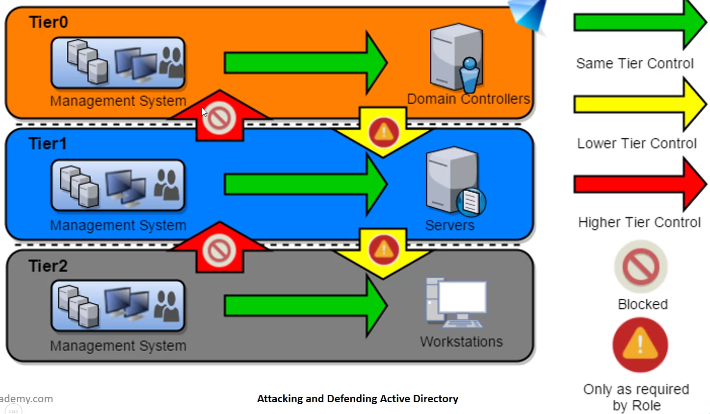
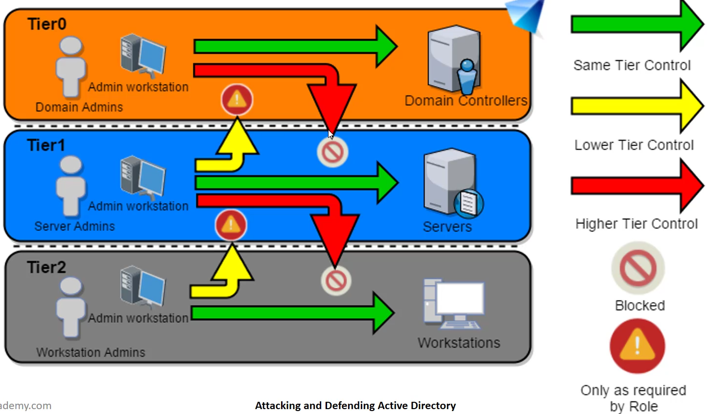
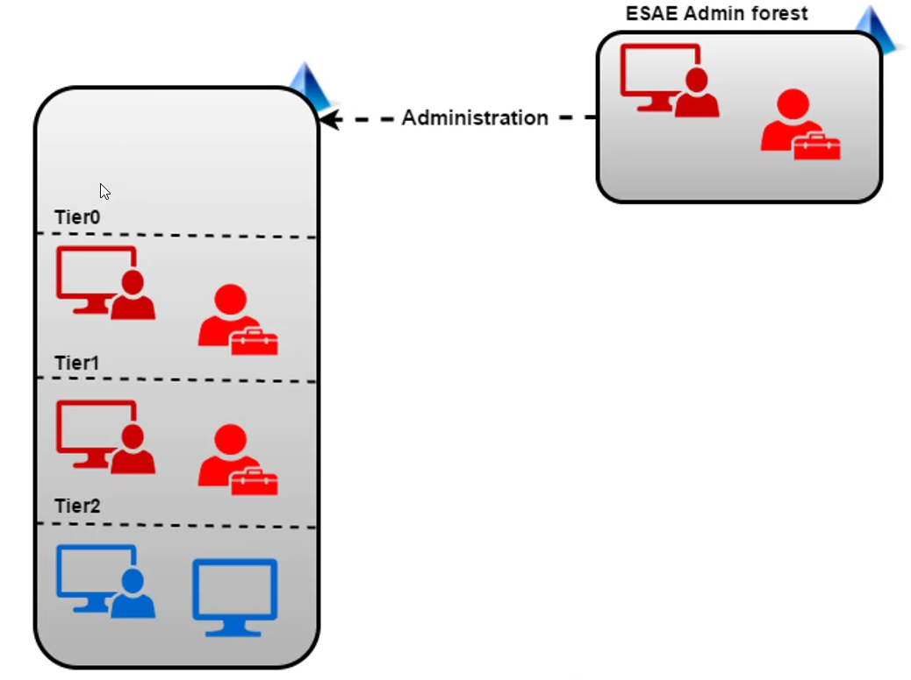

# Active Directory Detection and Defense

## Big Picture
* Look for flow of credentials and privs in your environment
* Log events and **monitor** the logs
* Purple Teaming
* Work culture and Architectural Changes

### Flow of Creds and Privs
* Domain Admins
  * Disallow or limit login of DAs to any machine other than DCs
  * If some logins are necessary, don't allow other admins to log into that machine
  * (*Try to*) Never run a service as DA. Many credential theft protections are made useless in this case
  * Temporary Group Membership (eg vendor needs DA) `Add-ADGroupMember -Identity 'Domain Admins' -Members newDA -MemberTimeToLive (New-TimeSpan -Minutes 20)`

### Logs
* Golden or Silver Ticket
  * Security EventID 4624: Account Logon
  * Security EventID 4634: Account Logoff
  * Security EventID 4672: Admin Logon
  * `Get-WinEvent -FilterHashtable @{Logname='Security';ID=4672} -MaxEvents 1 | Format-List -Property *`
* Skeleton Key
  * System EventID 7045: A service as installed in the system (Type: Kernel Mode driver)
  * If "Audit Privilege Use" is enabled:
    * Security EventID 4673: Sensitive Privilege User
    * Security EventID 4611: A trusted logon process has been registered with the LSA
  * `Get-WinEvent -FilterHashtable @{Logname='System';ID=7045} | ?{$_.message -like "*Kernel Mode Driver*"}`
  * Mitigation: running lsass.exe as a protected process forces attacker to load a kernel mode driver
    * Set up: `New-ItemProperty HKLM:\SYSTEM\CurrentControlSet\Control\Lsa\ -Name RunAsPPL -Value 1 -Verbose`
    * Verify after reboot: `Get-WinEvent -FilterHashtable @{Logname='System';ID=12} | ?{$_.message -like "*protected process*"}`
    * NB Some drivers or plugins may not work when lsass is protected. Requires thorough testing.
* DSRM
  * EventID 4657: audit creation/change of HKLM:\System\CurrentControlSet\Control\Lsa\DsrmAdminLogonBehavior
* Malicious SSP
  * EventID 4657: audit creation/change of HKLM:\System\CurrentControlSet\Control\Lsa\SecurityPackages
* Kerberoast
  * Security EventID 4769: A Kerberos ticket was requested.
  * However: There will be LOADS of these, so kerberoast is hard to detect. Some filtering can help:
    * POC: ```Get-WinEvent -FilterHashtable @{Logname='Security';ID=4769} -MaxEvents 1000 | ?{$_.Message.split("`n")[8] -ne 'krbtgt' -and $_.Message.split("`n")[8] -ne '*$' -and $_.Message.split("`n")[3] -notlike '*$@*' -and $_.Message.split("`n")[18] -like '*0x0*' -and $_.Message.split("`n")[17] -like "*0x17*"} | select -ExpandProperty message``` (service name != krbtgt, service name != *$, acct name != machine@domain, failure code = 0x0 (success), ticket encryption type = 0x17)
  * Mitigation
    * Service Acct passwords should be hard to guess (> 25 characters)
    * Use Managed Service Accounts (automatic change of password periodically and delegated SPN mgmt)
* Delegation
  * Limit DA/Admin logins to specific servers
  * Set "Account is sensitive and cannot be delegated" for privileged accounts
* ACL Attacks
  * Most useful logs are not enabled by default. Must enable Audit Policy for object. If so, we can see:     
    * Security EventID 4662: An operation was performed on an object
    * Security EventID 5163: A directory service object was modified
    * Security EventID 4670: Permissions on an object were changed
  * Useful tool: ADACLScanner - creates and compares reports of ACLs to identify any changes
* Trust Tickets
  * Defense: SID Filtering
    * Avoid attacks which abuse SID history attribute **across forest trust**
    * Enabled by default on all *inter-forest* trusts. Within a forest, if the child domain is compromised, the whole forest can be assumed compromised. The forest (not domain) is the security boundary.
    * BUT: Since SID filtering has potential to break applications and user access, it is often disabled
  * Defense: Selective Authentication - in an inter-forest trust, users will not be automatically authenticated across the trusts. Individual access to domains and servers in the trusting domain/forest should be explicitly granted.
* Microsoft Advanced Threat Analytics (ATA)
  * Traffic to DCs is mirrored to ATA sensors. User activity profile is built over time
  * Collects event 4776 (The DC attempted to validate the credentials for an account) to detect credential replay attacks
  * can detect
    * behaviour anomalies
    * recon: account enum, netsession enum
    * compromised credential attacks: brute force, high priv/service acct in clear text, honey token, unusual protocols
    * credential/hash/ticket replay attacks
  * To evade: 
    * Don't run `Invoke-UserHunter` against DC (use `-ComputerFile` parameter - take output of `Get-NetComputer`, exclude DC, save as file)
    * PTH with `sekurlsa::pth`, include the other hash types *as well as* ntlm `/aes256:<hash> /aes128:<hash> /ntlm:</hash>` 
    * Golden Ticket with `kerberos::golden`, use AES keys *instead of* ntlm: `/aes256:<aes256keyofkrbtgt>`
    * Golden ticket for non-existent user will not be detected by ATA (but *will* be noticeable in logs)
    * DCSync from a non-DC will be detected

### Architectural Changes
* Local Administrator Password Solution (LAPS)
  * Centralized storage of passwords in AD with periodic randomizing, read permissions are access controlled
  * Computer objects get 2 new attributes
    * ms-mcs-AdmPwd - stores cleartext password
    * ms-mcs-AdmPwdExpirationTime - controls password change
  * Storage in cleartext, transmission is encrypted
  * Possible to retrieve which users can access clear text passwords (provides list of attractive targets)
* Windows Defender Credential Guard
  * virtualization-based, isolate secrets so only privileged system software can access
  * effective in stopping PTH by restricting access to NTLM hashes and TGTs. Cannot write Kerberos tickets to memory even if we have credentials.
  * Only protects lsass process. Creds for local accounts in SAM and Service account creds from LSA Secrets are **not** protected.
  * Cannot be enabled on DC
* Windows Defender Device Guard
  * group of features to harden system against malware attacks. Ensuring only known good code can run
  * Three primary components
    * Configurable Code Integrity (CCI) - configure only trusted code to run
    * Virtual Secure Mode Protected Code Integrity - enforces CCI with Kernel Mode (KMCI) and user mode (UMCI)
    * Platform and UEFI Secure Boot - ensures boot binaries and firmware integrity
  * UMCI intereferes with most lateral movement attacks we have seen
  * Depends on implementation, but many well known application whitelisting bypasses - signed binaries like csc.exe with installutil.exe, msbuild.exe, etc - are useful for bypassing
* Protected Users Group
  * users in this group:
    * Cannot use CredSSP and WDigest - no more cleartext cred caching
    * NTLM hash is not cached
    * Kerberos does not use DES or RC4 keys. No caching of cleartext cred or long term keys
    * If domain functional level is Server 2012R2:
      * No NTLM auth
      * No DES or RC4 keys in Kerberos pre-auth
      * No delegation (constrained or unconstrained)
      * No renewal of TGT beyond initial hour lifetime - hardcoded, unconfigurable "Max lifetime for user ticket" and "Max lifetime of user ticket renewal"
  * All DCs must be at least Server 2008 or later
  * Not recommended to ad DAs and EAs to this group - potential lock-out
  * No cached logon (ie no offline signon)
  * Putting Computer and Service accts in this group is pointless as their creds will always be present on the host machine
* Privileged Administrative Workstations (PAWs)
  * hardened workstation for performing sensitive tasks like administration of DCs, cloud infrastructure, sensitive business functions etc
  * can provide protection from phishing, OS vulns, cred replay attacks
  * Admin Jump servers to be accessed only from a PAW, multiple strategies
    * separate privilege and hardware for administrative and normal tasks
    * Having a VM on a PAW for user tasks
* AD Administrative Tier Model
  * Composed of 3 levels only for administrative accounts:
    1. Tier 0 - Accounts, Groups, Computers which have privileges across the enterprise like DCs, DAs, EAs
    2. Tier 1 - Accounts, Groups, Computers which have access to resources with a significant amount of business value. EG Server Administrator role maintains OSes with the ability to impact all enterprise services
    3. Tier 2 - Administrator accounts which have admin control of a significant amount of business value that is hosted on user workstations and devices. EG Help Desk and Support Admins because they can impact the integrity of almost any user data
  * Control restrictions - what admins control <br/>
  * Logon restrictions - where admins can log on <br/>
* Enhanced Security Admin Environment (ESAE) *(aka Red Forest)*
  * Dedicated administrative forest for managing critical assets like administrative users, groups, and computers. <br/>
  * Since a forest is considered a security boundary, this model provides enhanced controls.
  * Selective Authentication to the Red Forest enables stricter security controls on logon of users from non-administrative forests
* Powershell
  * Upgrade to PowerShell 5.1 (NOT 6.0.0 - that is PowerShell Core which lacks many security features of Powershell 5.1)
  * PowerShell Whitelisting
    * Use Applocker and Device Guard to restrict PowerShell scripts. If Applocker is configured in "Allow Mode" for scripts, PowerShell 5 automatically uses Constrained Language Mode.    
    * Both supported by GPO
    * Whitelisting Bypasses
      * Depending on implmentation, can use `msbuild` and `System.Management.Automation` namespace to load Powershell functionality `[...]\v4.0.30319\msbuild.exe pshell.xml`
  * Enhanced Logging (all can be enabled using GP)
    * script block logging
      * logs contents of all the script blocks processed by the PS engine regardless of host used.
      * by default only first execution of a scriptblock is logged (Verbose 4104). Can log scriptblock invocation start/stop events (4105/4106), but this is a huge increase in number of logs
      * PS v5 onwards logs (4104) some suspicious scriptblocks automatically based on a list of suspicious commands
      * records original obfuscated code as well as decoded and deobfuscated code
    * system-wide transcription
      * enables console logging for everything (powershell.exe, ISE, custom hosts - .NET dll, msbuild, installutil) that uses powershell engine
      * transcripts are text files. Should fwd transcripts to log system to avoid tampering and disk space issues
      * known problems: too many logs in an enterprise level network; Enabling transcripts on a DC breaks the AD Administration Centre GUI
    * Module logging
      * since v3. can log pipeline execution and command execution events
      * huge number of logs when enabled
  * AMSI (Antimalware Scan Interface)
    * provides registered antivirus access to contents of script before execution
    * allows detection regardless of input method (disk, memory, encoded command)
    * enabled by default on Win10, supported by Windows Defender
    * depends on signature-based detection by registered antivirus (no detection of its own)
  * Constrained PowerShell
    * In Constrained Language Mode, all Windows cmdlets and elements are allowed but only allows limited types. `Add-Type`, Win32 APIs, COM objects are not allowed
    * not easy to implement enterprise-wide
  * JEA (Just Enough Administration)
    * provides role-based access control for PS-based remote delegated administration
    * permits non-admin users to connect remotely to machines for doing specific tasks
    * JEA endpoints have PS transcription and logging enabled
  * **Bypasses**
    * Downgrade PS to v2
      * v2 lacks *all* detection mechanisms
      * can be called using `-Version` param or by using v2 reference assemblies
      * v2, 3, 3.5 of .NET is required to use v2. PS v2 features must be enabled (true by default)
      * Detection: EventID 400 contains engine version
    * Unloading, disabling, or unsubscribing
      * Bypass logging
      * GP is cached by PS for efficiency, so we can read and change it within PS without admin rights  https://cobbr.io/ScriptBlock-Logging-Bypass.html https://cobbr.io/ScriptBlock-Warning-Event-Logging-Bypass.html 
      * These bypasses are logged unless obfuscated
      * Bypass AMSI ```sET-ItEM ( 'V'+'aR' +  'IA' + 'blE:1q2'  + 'uZx'  ) ( [TYpE](  "{1}{0}"-F'F','rE'  ) )  ;    ( GeT-VariaBle  ( "1Q2U"  +"zX"  )  -VaL  )."A`ss`Embly"."GET`TY`Pe"((  "{6}{3}{1}{4}{2}{0}{5}" -f'Util','A','Amsi','.Management.','utomation.','s','System'  ) )."g`etf`iElD"(  ( "{0}{2}{1}" -f'amsi','d','InitFaile'  ),(  "{2}{4}{0}{1}{3}" -f 'Stat','i','NonPubli','c','c,'  ))."sE`T`VaLUE"(  ${n`ULl},${t`RuE} ) ``` Without obfuscation, Windows Defender detects known AMSI bypasses
    * Obfuscation (eg ```Get-Field``` -> ```GetFiel`d```)
      * defeats scriptblock logging, warning level autologging and AMSI when done right
      * Tools: `Invoke-Obfuscation` and `Invoke-CradleCrafter` from  `git clone https://github.com/danielbohannon/Invoke-Obfuscation.git` (runs in PS Core on Linux)
      * To avoid detection of obfuscation, strive to do the minimum amount of obfuscation required.
    * Bypass using PS v6
      * v6 (*PS Core, not Windows PS*) only has 2 of the security features - warning scriptblock logging (not automatic) and AMSI.
      * PS v6 (pwsh.exe) may not be in Constrained Language Mode, even if v5 is.
    * Trust abuse (using trusted executables and code injection in trusted scripts)
    * NB Many bypasses leave log entries that can be used to detect them

#### Deception
* use of decoy domain objects to trick adversaries to follow a particular attack path to increase chances of detection and increase their cost (in time)
* typical usage limited to: leave honey credentials on some boxes and monitor for their usage BUT can use effectively during other phases of an attack
* provide what adversaries are looking for. For example:
  * Users: password doesn't expire, trusted for delegation, users with SPN, password in description, members of high priv groups, users with ACL rights over other users/groups/containers
  * Computers: older OSes, interesting SPN, delegation settings, member of privileged groups
* Deploy-Deception: Enumeration
  * Decoy Users
    * `Create-DecoyUser -UserFirstName user -UserLastName manager -Password Pass@123 | Deploy-UserDeception -UserFlag PasswordNeverExpires -Verbose` 
    * A GenericRead or ReadProperty triggers event 4662 (even when decoy user is not specifically enumerated eg `net user /domain` or `Get-NetUser`)
    * Better to use an obscure/rare property (eg x500uniqueidentifier) and turn on auditing when that property is read for "Everyone". This will reduce noise (`net user /domain` won't trigger the log, but `Get-NetUser` would). `Create-DecoyUser -UserFirstName user -UserLastName manager_uncommon -Password Pass@123 | DeployUserDeception -UserFlag PasswordNeverExpires -GUID d07da11f-8a3d-42b6-b0aa-76c962be719a -Verbose`
    * Similar for user SPN `Create-DecoyUser -UserFirstName user -UserLastName managerspn -Password Pass@123 | Deploy-UserDeception -SPN 'dc/MSSQLSvc' -GUID f3a64788-5306-11d1-a9c5-0000f80367c1 -Verbose`
  * Decoy Computers
    * better to use actual computers to avoid easy identification. Should either be VMs or turned off after joining domain unless they are used as honeypots
    * audit when x500uniqueidentifier is read `Create-DecoyComputer -ComputerName dcorp-web -Verbose | Deploy-ComputerDeception -PropertyFlag TrustedForDelegation -GUID d07da11f-8a3d-42b6-b0aa76c962be719a -Verbose`
    * audit when DACL is read `Deploy-ComputerDeception -DecoyComputerName comp1 -PropertyFlag TrustedForDelegation -Right ReadControl -Verbose`
  * Decoy Groups
    * audit when DACL read `Create-DecoyGroup -GroupName "Forest Admins" -Verbose | Deploy-GroupDeception -AddMembers usermanager AddToGroup dnsadmins -Right ReadControl -Verbose`
* Deploy-Deception: Lateral Movement
  * Users
    * DA who is denied logon: `Create-DecoyUser -UserFirstName dec -UserLastName da Password Pass@123 | Deploy-PrivilegedUserDeception Technique DomainAdminsMemebership -Protection DenyLogon -Verbose`
    * Enable Directory Access (4662) auditing on the above user: `Deploy-UserDeception -DecoySamAccountName decda -GUID d07da11f-8a3d-42b6-b0aa-76c962be719a -Verbose`
    * Create master user with `FullControl` over slave user - attracts adversary looking at ACLs. Can make one or both privileged, set SPN, etc
      * `Create-DecoyUser -UserFirstName master -UserLastName user -Password Pass@123`
      * `Create-DecoyUser -UserFirstName slave -UserLastName user -Password Pass@123 | Deploy-SlaveDeception -DecoySamAccountName masteruser -Verbose`
      * `Deploy-UserDeception -DecoySamAccountName slaveuser -Principal masteruser -Right WriteDacl -Verbose`
* **Identifying and Avoiding Deception**
  * look at object properties like objectSID, lastlogon, lastlogontimestamp, logoncount, whencreated, badpwdcount. Compare with known real objects.
  * get actual DC by looking at env var logonserver. Use DC properties to compare to other computers. Compare SID of other users with RID 500 and other built-in accts
  * For multiple enterprise deception solutions, WMI only retrieves actual objects and not fake ones
  * Avoid automated enumeration tools unless you absolutely know what they are doing in the background
  * Stop going for lowest hanging fruit. If it looks to good to be true, investigate carefully!
  * Avoid the urge to go for DA - focus on the goals of your operation
  * Invoke-HoneyBuster
* **Avoiding Identification**
  * Use actual AD objects (as in Deploy-Deception)
  * For user decoys (incl DA decoys), create some logon events to avoid suspicious properties

#### Recommended further reading
* Securing Privileged Access: https://docs.microsoft.com/en-us/windows-server/identity/securingprivileged-access/securing-privileged-access 
* Best Practices for Securing Active Directory: https://docs.microsoft.com/en-us/windows-server/identity/adds/plan/security-best-practices/best-practices-for-securing-activedirectory

